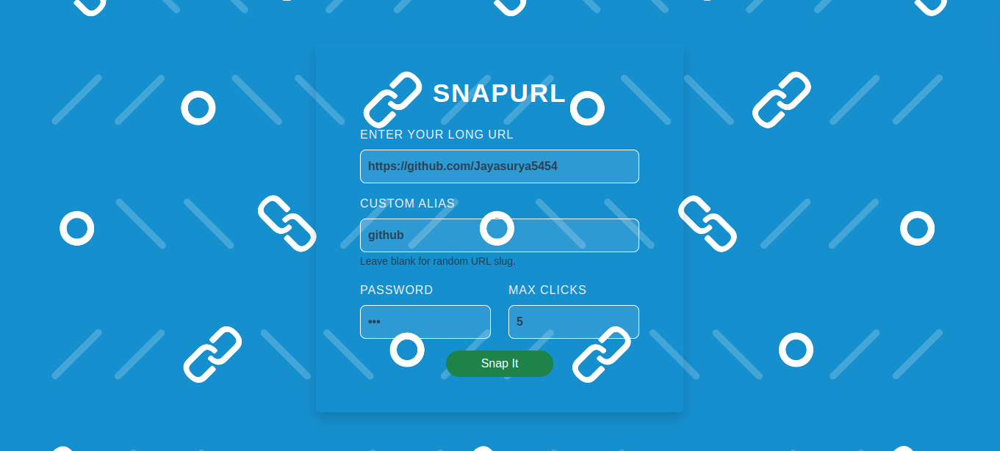
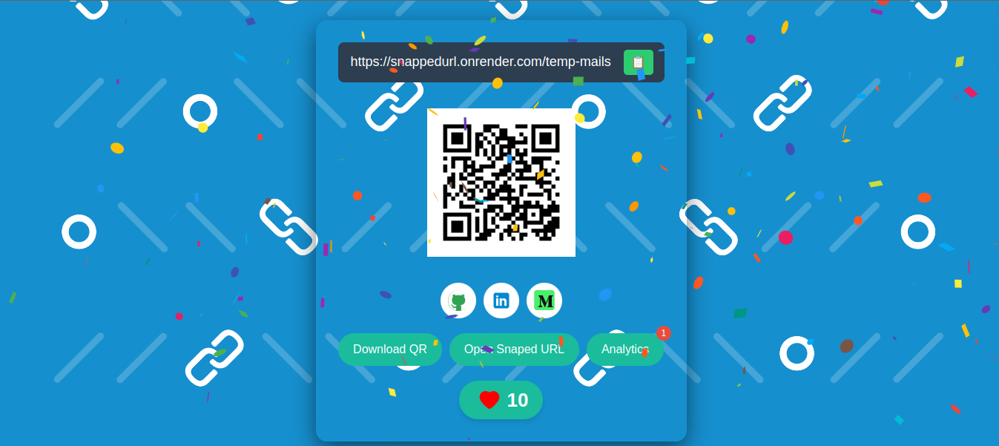
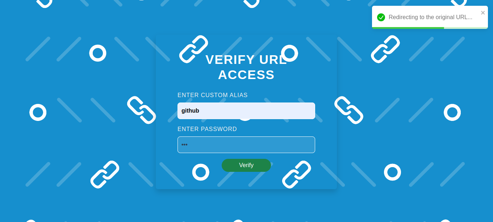

# SnapURL - Snap Your Uniform Resource Locator
SnapURL is a full stack application designed to help users shorten URLs quickly and efficiently. It offers a range of features including URL shortening, click limiting, password protection, and QR code generation.

## Preview - Live in the Market
You can preview the application [SnapURL](https://snappedurl.netlify.app).

## Features

- Shorten long URLs
- Protect your short URL with a password
- Limit the number of clicks on shortened URLs
- Generate QR codes for shortened URLs
- Track the number of clicks on shortened URLs
- Copy shortened URLs to clipboard
- User-friendly interface

## Tech Stack

- React
- Node.js
- Express
- MongoDB

## Installation

1. Clone the repository:
    ```bash
    git clone https://github.com/jayasurya5454/SnapURL.git
    ```
2. Navigate to the project directory:
    ```bash
    cd SnapURL
    ```
3. Install dependencies for both frontend and backend:
    ```bash
    cd snapurl-frontend
    npm install
    cd ../snapurl-backend
    npm install
    ```

## Usage

1. Start the backend server:
    ```bash
    cd snapurl-backend
    npm start
    ```
2. Start the frontend development server:
    ```bash
    cd ../snapurl-frontend
    npm start
    ```
3. Open your browser and navigate to `http://localhost:5173`

## Website Screenshots

### Dashboard view


### Result view


### Password Verification view


## Deployment Status

[](https://app.netlify.com/sites/snappedurl/deploys)

## License

This project is licensed under the Apache License 2.0. See the [LICENSE](LICENSE) file for details.
